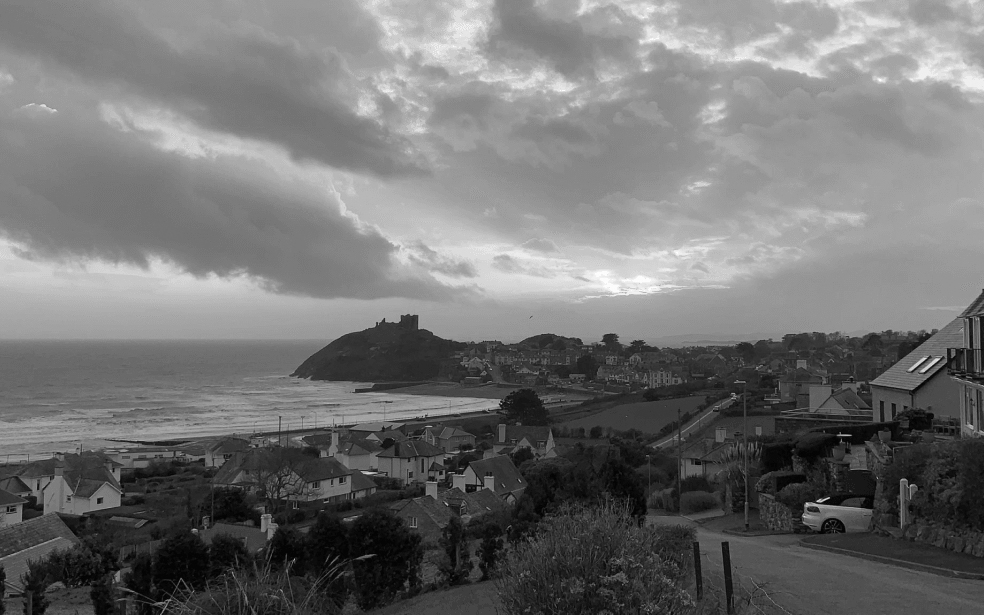

# Project 3: From Homeland to Homeland

## Project Description
####  Incredible story about people from different parts of the Earth which are working together to make a great influence to the world of high technologies. It doen't matter where you from! the only one thing is extremely important : your own motivation to do something realy great!

### Project technologies:
1. HTML cascade
2. CSS including Flex and Grid layouts and @mediascreen properties for several screen resolutions
3. media queries (adapted for all screen sizes)
4. Figma design tool 
5. BEM based file structure

  
**Intro**    
  
This is a project that showcases the hometowns of some of Practicum's employees. We've made it so all the elements are displayed correctly on popular screen sizes. We recommend investing more time in completing this project, since it's more difficult than previous ones.  
  
**GitHub page's link**  
#### ["Practicum Art Gallery"](https://meleana.github.io/web_project_3/) 
  
## Plan on improving the project

- Design discussion. Error correction/redesign/elimination of visual inaccuracies
- Adding content
- Creating 2 page wrappers (width and full width)
- Improve photo quality depending on device (screen size)
- Adaptation/reduction of code
- Include links to various media sources of photo authors
- Possibility to purchase photos through the site 
- Create a mobile app
